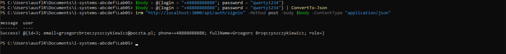
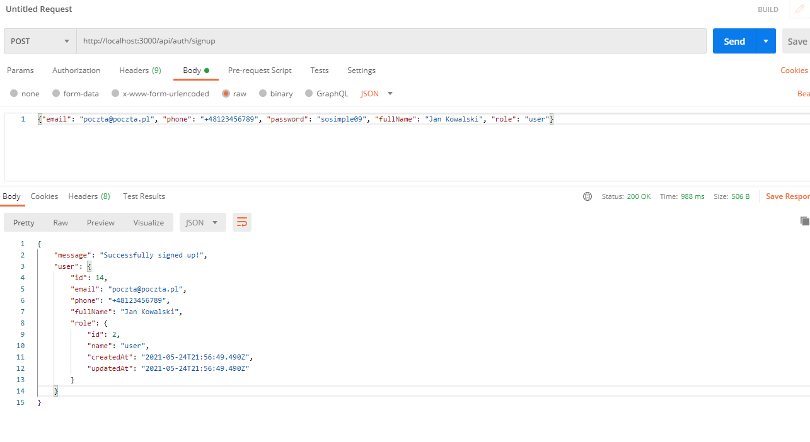

# Lab05 SOA Project

A simple use case REST API powered by **PostgreSQL**, **Node.js**, **Sequelize ORM**, **Express** written in *Typescript.*

Prequisities:

- PostgreSQL 13
- Node.js 16.x.x
- Yarn

Install project dependencies:
`yarn install`

To run in *Dev* mode:
`yarn dev`

Also you can lint code:
`yarn lint`

To build project run:
`yarn build`

Result will appear in `dist/` folder

Happy Hacking!

# About project

This project implements the SOA architecture pattern, thanks to typescript library 'typedi'.
In simple words this is the container of services. In this project we have *Sequelize models*, *Winston Logger*, and the AuthService as a services, which are injected into application container and there are accessible from any place of the code inside application.

## How to use

Available routes

- **status/** GET, HEAD 
  Healthcheck routes.

- **api/** GET
  List available API routes.

- **api/auth/** GET
  List available auth operations such as **signin** or **signup**.

- **api/auth/signin** POST
  Sign in user.
  Requires *login* and *password* in request body.

- **api/auth/signup** POST
  Register new user.
  Requires *email*, *phone*, *password*, *fullName* and *role* in request body.

Examples of requests:

- Using PowerShell:

- Using Postman:

